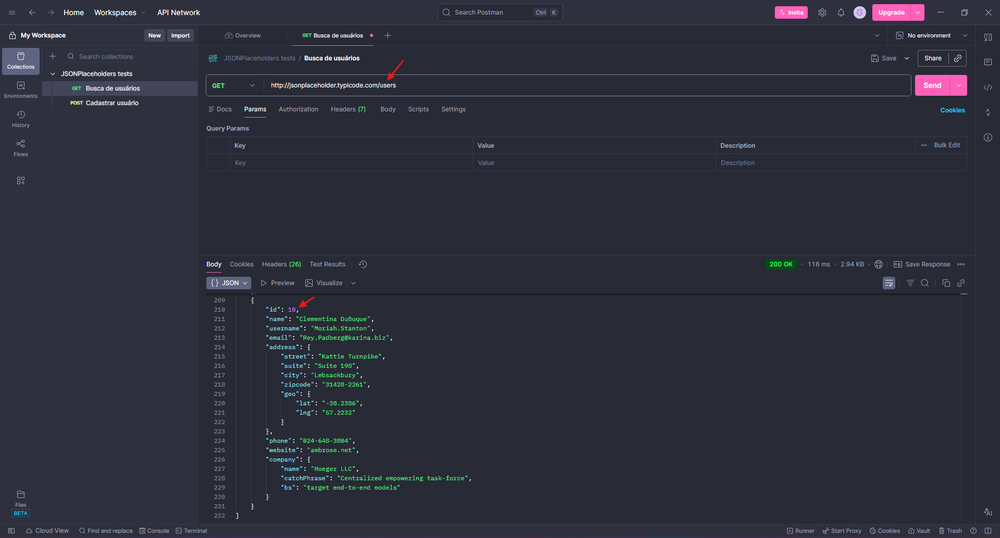
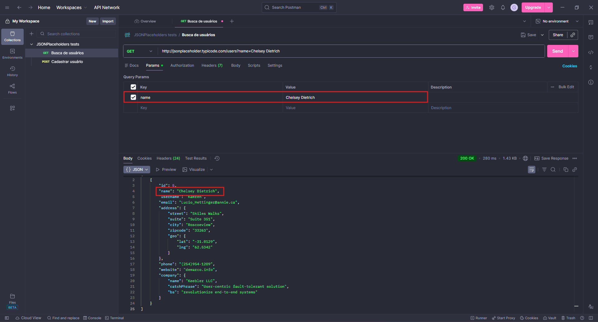
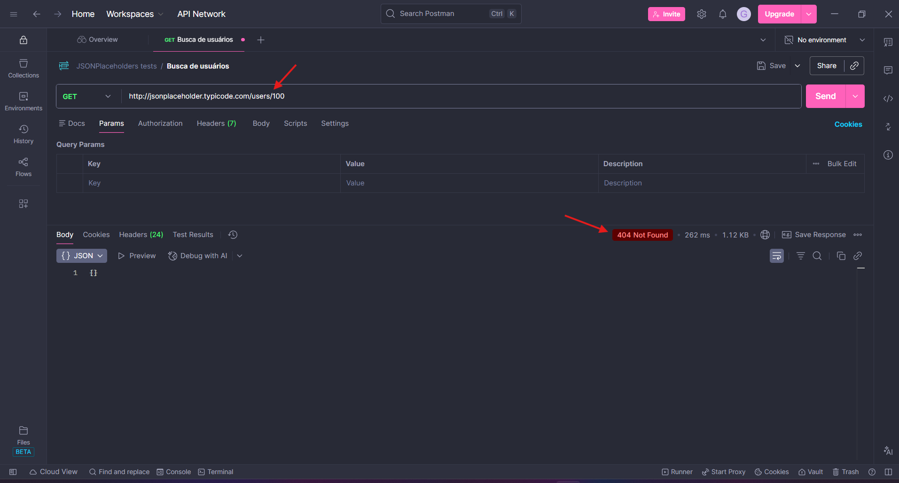

# Cenário 01 | Casos de Teste - GET / Users 👤

## 🚨 Pré-condições antes de executar os CTS
- Pré-condições: API do JSONPlaceholder disponível em `https://jsonplaceholder.typicode.com/`.

 

## CT01: Buscar usuários cadastrados
- Passos:
    1. Criar uma nova requisição no Postman e selecionar o método GET.
    2. No campo de URL, colar a URL da API com o endpoint `/users`.
    3. Clicar em "Send".
- Dado: 
    - Deve ser exibida uma lista de usuários, com informações como id, name, ursername, address (street, suite, city, zipcode, geo (lat, lng)), phone, website e company (name, catchPhrase, bs).
    - O status da requisição deve ser "200 OK".
- Resultado esperado: Lista de usuários com as informações desejadas sendo exibida com sucesso, juntamente com o status "200" da requisição.
- Resultado obtido: OK
- Status: Passou
- Evidências: 

  

 

  

## CT02: Buscar um usuário pelo seu nome
- Passos:
    1. Criar uma nova requisição no Postman do tipo de método GET.
    2. No campo de URL, colar a URL da API com o endpoint `/users`.
    3. Na coluna "Key" da aba "Params", inserir "name".
    4. Na coluna "Value", inserir o nome do usuário desejado a retornar informações.
    5. Clicar em "Send".
- Dado: 
    - Informações do usuário procurado através do seu nome sendo exibidas com sucesso.
    - O status da requisição deve ser "200 OK".
- Esperado: Informações do usuário procurado pelo nome sendo exibidas com sucesso, juntamente com o status "200 OK" da requisição.
- Resultado obtido: OK
- Status: Passou
- Evidências:

 

  

## CT03: Buscar um usuário pelo seu id
- Passos:
    1. Criar uma nova requisição no Postman do tipo de método GET.
    2. No campo de URL, colar a URL da API com o endpoint `/users`.
    3. Na coluna "Key" da aba "Params", inserir "id".
    4. Na coluna "Value", inserir o id do usuário desejado a retornar informações.
    5. Clicar em "Send".
- Dado: 
    - Informações do usuário procurado através do seu id sendo exibidas com sucesso.
    - O status da requisição deve ser "200 OK".
- Esperado: Informações do usuário procurado pelo seu id sendo exibidas com suceso, juntamente com o status "200 OK" da requisição.
- Resultado obtido: OK
- Status: Passou
- Evidências: 

 

  

## CT04: Tentar localizar um usuário inexistente pelo seu id
- Passos:
    1. Criar uma nova requisição no Postman do tipo de método GET.
    2. No campo de URL, colar a URL da API com o endpoint `/users/100`.
    3. Clicar em "Send".
- Dado: Deve ser retornado o status "404 Not Found".
- Esperado: Status "404 Not Found" retornado com sucesso.
- Resultado obtido: OK
- Status: Passou
- Evidências:

 

