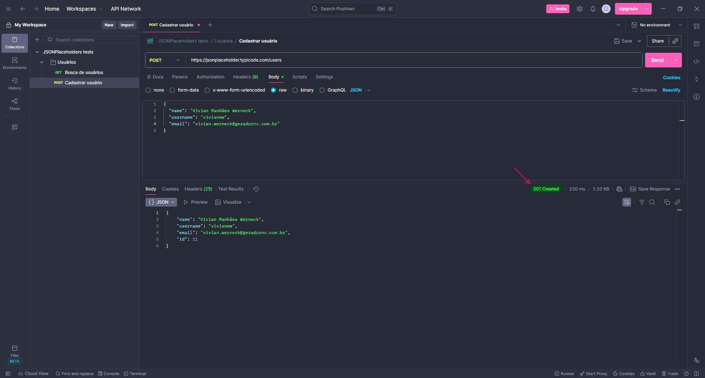

# Cenário 02 | Casos de Teste - POST / Users 👤

## 🚨 Pré-condições antes de executar os CTS
- Pré-condições: API do JSONPlaceholder disponível em `https://jsonplaceholder.typicode.com/`.

<br>

## CT01: Cadastrar usuário
- Pré-condições: API do JSONPlaceholder disponível em `https://jsonplaceholder.typicode.com/`.
- Passos: 
    1. Criar uma nova requisição no Postaman e selecionar o método POST.
    2. No campo da URL, colar a URL da API com o endpoint `/users`.
    3. Na aba "Body" da requisição, selecionar a opção "raw".
    4. Em "raw", selecione a opção "JSON".
    5. No campo de texto, cole o seguinte código:  
    ```bash
    {
        "name": "João Silva",
        "username": "joaosilva",
        "email": "joaosilva@exemplo.com"
    }s
    ```
    6. Clicar em "Send".
- Dado:
    - O status da requisição deve ser "201 Created".
    - O retorno da resposta deve conter os dados cadastrados nos campos name, username, email e id.
- Esperado: Retorno da requisição sendo "201 Created"
- Resultado obtido: OK
- Status: 
- Evidência: 

<br>

<p style="text-align: center;"></p>