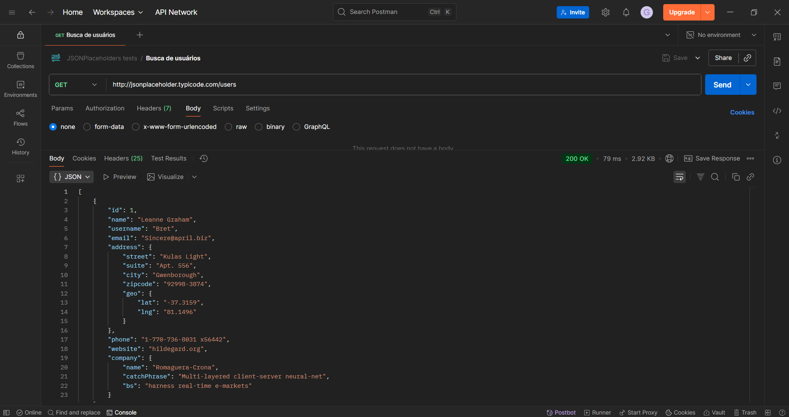
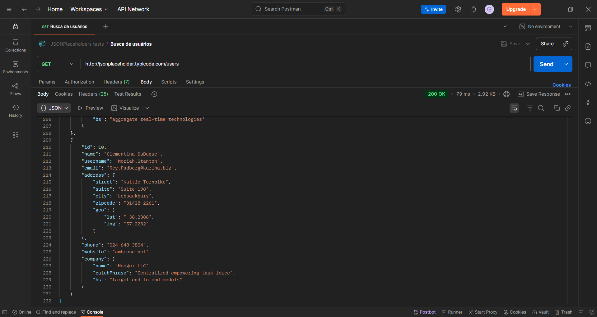

# Test Case - GET / Users 👤

## TC01: Buscar usuários cadastrados
- Pré-condições: API do JSONPlaceholder disponível em `https://jsonplaceholder.typicode.com/`.
- Passos:
    1. Criar uma nova requisição no Postman e selecionar o método GET.
    2. No campo de URL, colar a URL da API com o endpoint `/users`.
    3. Clicar em "Send.
    4. Verificar que o corpo da resposta contém uma lista de usuários.
    5. Verificar que cada registro contém id, name, username, email, address (street, suite, city, zipcode, geo (lat, lng)), phone, website, company (name, catchPhrase, bs).
- Resultado esperado:
    - O status da requisição deve ser "200 OK".
    - Deve ser retornado no corpo da resposta uma lista de usuários cadastrados com os campos especificados.
- Resultado obtido: OK.
- Eviências: 

  

 

